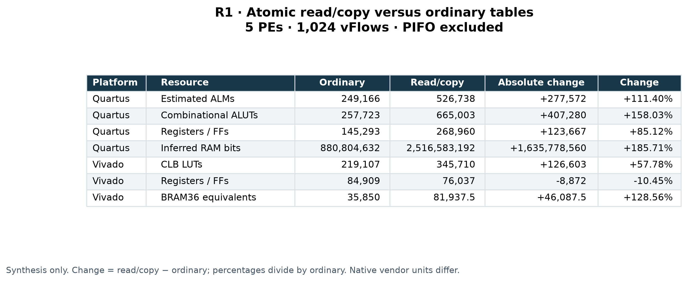
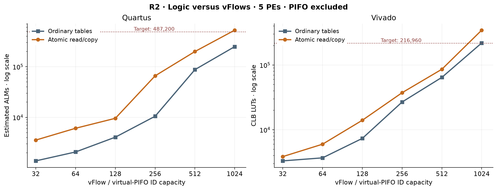
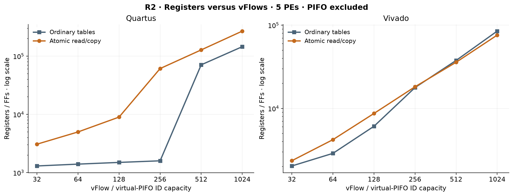
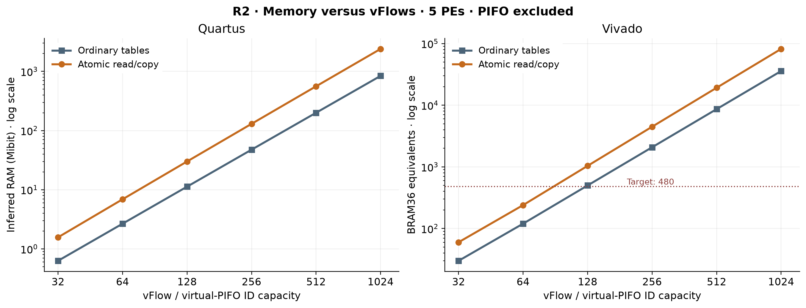
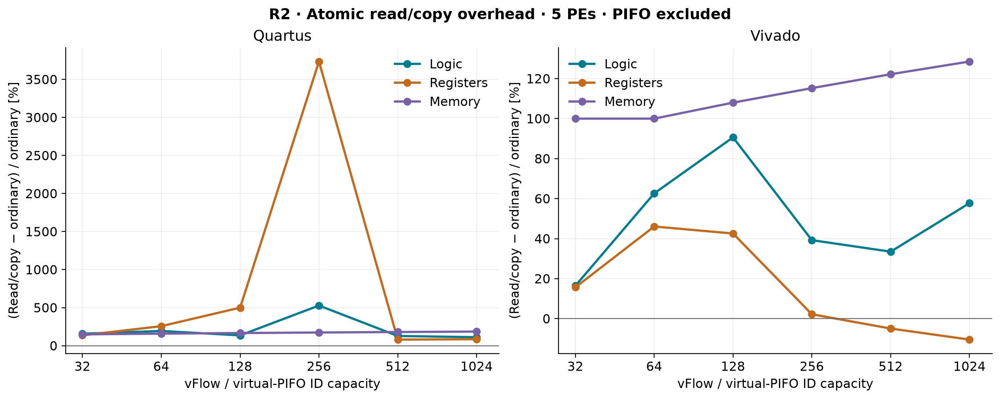
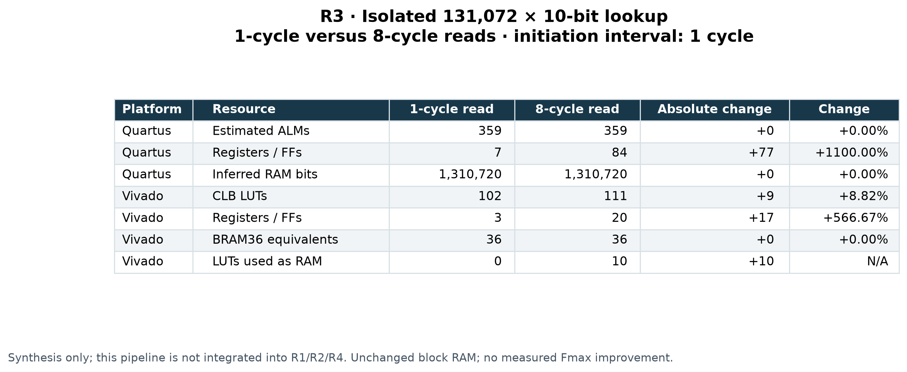
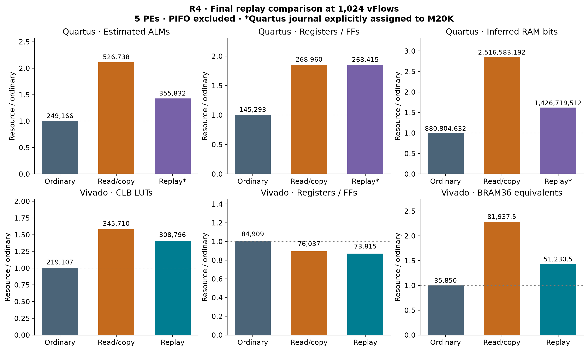
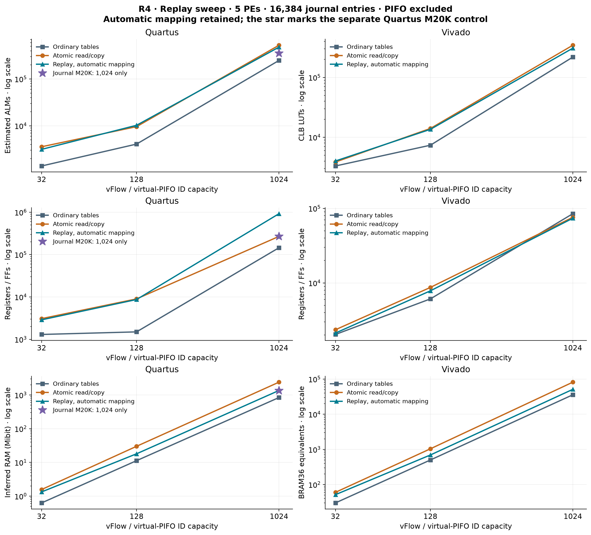
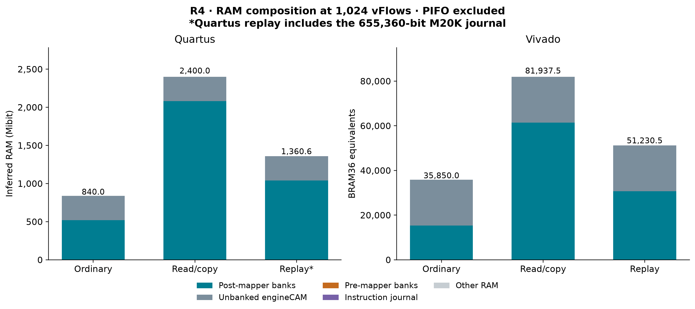

# RIO dynamic configuration: synthesis resource report

Completed evidence through 2026-09-07 · synthesis milestone 8e73f57 · Quartus Pro 25.3.1 and Vivado 2025.2.

All requested fixed-size, vFlow-sweep, isolated lookup-pipeline, and controller-replay synthesis cases are complete. This report regenerates figures from the archived measurements. It includes the final Quartus journal-in-M20K control and preserves the original automatic-mapping results.

Controller replay substantially reduces the cost of the original read/copy implementation, but these results do not yet support a claim of negligible dynamic-configuration overhead. The latest replay implementation still adds about 41–43% logic over ordinary tables at 1,024 vFlows, and the dense table geometry exceeds the reference devices' memory capacity.

| Platform | Resource | Final replay | vs ordinary | vs read/copy |
|---|---|---|---|---|
| Quartus | Estimated ALMs | 355,832 | +42.81% | -32.45% |
| Quartus | Inferred RAM bits | 1,426,719,512 | +61.98% | -43.31% |
| Vivado | CLB LUTs | 308,796 | +40.93% | -10.68% |
| Vivado | BRAM36 equivalents | 51,230.5 | +42.90% | -37.48% |

Final replay means journal-only M20K assignment for Quartus at 1,024 IDs, and the original RAM-mapped replay run for Vivado. Percentages use each platform's own resource units. All counts exclude PIFO cores; they are not total-scheduler overhead percentages.

| Experiment | Requested comparison | Completed evidence |
|---|---|---|
| R1 | 5 PEs, 1,024 vFlows, 1,024 shared PIFO entries per PE reserved | 4 vendor/variant results |
| R2 | 32, 64, 128, 256, 512, 1,024 vFlows; ordinary vs read/copy | 24 results; R1 reuses the 1,024 point |
| R3 | 131,072 × 10-bit lookup; 1 vs 8 cycles | 4 synthesis results plus simulation |
| R4 | Replay vs both baselines at 32, 128, 1,024 vFlows | 18 results, including reused baselines |
| Journal control | Quartus automatic vs M20K; isolated and full core | 4 results, including the original full-core replay reference |

## Measurement scope and tool setup

All mesh comparisons use five PEs, eight-bit ranks, a 100 MHz clock constraint, and 1,024 shared PIFO slots per PE as an integration budget. An explicit external-PIFO interface exposes requests, responses, empty status, and drain events. The controller, command queues and routing, mapper tables, brain/state logic, PE streams, and crossbar remain observable runtime hardware. Sorting, PIFO entry storage, occupancy tracking, and drain detection are outside the netlist.

The ordinary baseline has one synchronous RAM per mapper. It retains the configuration controller and normal command path, applies writes immediately, consumes commit messages as no-ops, and prunes commit/swap/synchronization/drain-armed rewrite logic. It is still programmable; this comparison measures the cost of atomic reconfiguration relative to ordinary lookup tables, not the cost of all programmability relative to a compile-time fixed scheduler.

Read/copy uses the original atomic double banks and synchronization reads. Replay uses two banks with one packet-read port and one write port each, plus a shared instruction journal and commit/replay control. All journal and controller costs are included.

| Setting | Quartus | Vivado |
|---|---|---|
| Installed version | Pro 25.3.1 Build 100 | 2025.2 |
| Install root | /data/work/quartus/quartus | /data/work/vivado/2025.2/Vivado |
| Target | Agilex 7 AGFB014R24B2E2V | Kintex UltraScale+ xcku5p-ffvb676-2-e |
| Board definition | Agilex 7 F-Series devkit BTS; no NIC/OpenCL shell | KCU116, board definition 1.5 |
| Synthesis settings | Balanced, virtual data pins, 8 threads | Out of context, rebuilt hierarchy, RuntimeOptimized, 8 threads |
| Constraint | 100 MHz target | 100 MHz target |
| License | Local LR-187458 license used successfully | Installed Standard license used successfully |
| Implementation | Not run | Not run |

Vivado estimates use the documented estimation-only hook that skips its pre-mapping device-capacity gate. It does not bypass licensing or change the reported device capacities. The hook was checked on an unchanged smaller RAM control. Quartus uses an equivalent compact zero-filled MIF initialization view, validated against the canonical RTL. Synthesis success and the 100 MHz constraint establish neither a physical fit nor achieved frequency.

Resource accounting: Quartus ALMs are estimated logic usage; ALUTs and registers are also reported. Its RAM metric is inferred Implementation Bits, including width pruning and replication, not fitted M20K allocation. Vivado reports mapped CLB LUTs, FFs, and BRAM36 equivalents (one RAMB36 or two RAMB18); allocated memory bits include primitive allocation. URAM and DSP usage are zero in these mesh runs. LUT RAM is reported separately and is already part of total LUT usage. ALMs and LUTs must not be compared as interchangeable units.

For every pair: absolute change = variant − baseline; percentage change = 100 × (variant − baseline) / baseline. A zero baseline produces N/A. Unreported resources stay unreported. The 1,024-ID Quartus read/copy RAM aggregate overflows a signed 32-bit field; the positive detailed RAM rows and disjoint hierarchy totals reconcile exactly to 2,516,583,192 bits. The raw report is preserved, and its missing MLAB count is not treated as zero.

[Detailed installed-tool setup and reproduction](../../../synthesis/README.md)

## R1: fixed setup, ordinary versus atomic read/copy

The requested fixed point is five PEs, 1,024 vFlows, and a reserved capacity of 1,024 PIFO entries per PE. These are legal RTL parameters. The PIFO implementation is excluded under the agreed experiment scope.

### Quartus

| Resource | Ordinary | Read/copy | Absolute change | Change |
|---|---|---|---|---|
| Estimated ALMs | 249,166 | 526,738 | +277,572 | +111.40% |
| Combinational ALUTs | 257,723 | 665,003 | +407,280 | +158.03% |
| Registers / FFs | 145,293 | 268,960 | +123,667 | +85.12% |
| Inferred RAM bits | 880,804,632 | 2,516,583,192 | +1,635,778,560 | +185.71% |
| DSP blocks | 0 | 0 | +0 | N/A |

### Vivado

| Resource | Ordinary | Read/copy | Absolute change | Change |
|---|---|---|---|---|
| CLB LUTs | 219,107 | 345,710 | +126,603 | +57.78% |
| Registers / FFs | 84,909 | 76,037 | -8,872 | -10.45% |
| BRAM36 equivalents | 35,850 | 81,937.5 | +46,087.5 | +128.56% |
| Allocated BRAM + URAM bits | 1,321,574,400 | 3,020,544,000 | +1,698,969,600 | +128.56% |
| LUTs used as RAM | 824 | 824 | +0 | +0.00% |
| URAM288 blocks | 0 | 0 | +0 | N/A |
| DSP blocks | 0 | 0 | +0 | N/A |

The original implementation adds 111.40% estimated ALMs on Quartus and 57.78% LUTs on Vivado. Memory grows by 185.71% and 128.56%, respectively. The lower Vivado FF count is a netlist mapping result; it does not offset additional LUT and RAM costs in a common unit. This baseline comparison does not demonstrate limited hardware overhead.



Figure 1. Fixed-point resource comparison. The CSV contains all reported resource categories; the figure selects the primary logic, register, and memory metrics.

[SVG](figures/r1-fixed/figure.svg) · [PDF](figures/r1-fixed/figure.pdf) · [CSV](figures/r1-fixed/data.csv)

[Original R1 report and raw-evidence links](../r1-fixed/report.md)

## R2: resource scaling with vFlow capacity

Only the vFlow/virtual-PIFO ID capacity changes: 32, 64, 128, 256, 512, and 1,024. The PE count, reserved PIFO capacity, rank width, and original lookup latency remain fixed. Figures 2–4 use logarithmic resource axes so all measured sizes remain visible. Lines connect completed points as visual guides; no missing size is estimated. Figure 5 uses a linear percentage axis.



Figure 2. Native logic usage versus vFlow capacity. Dotted lines show reported target logic capacity; passing a logic limit does not establish fit.

[SVG](figures/r2-logic/figure.svg) · [PDF](figures/r2-logic/figure.pdf) · [CSV](figures/r2-logic/data.csv)



Figure 3. Register/FF counts versus vFlow capacity. Vendor memory and logic mapping create non-smooth scaling.

[SVG](figures/r2-registers/figure.svg) · [PDF](figures/r2-registers/figure.pdf) · [CSV](figures/r2-registers/data.csv)



Figure 4. Quartus inferred RAM in Mibit (2^20 bits), and Vivado BRAM36 equivalents. These are different accounting metrics. The Vivado dotted line is the target's 480-tile capacity.

[SVG](figures/r2-memory/figure.svg) · [PDF](figures/r2-memory/figure.pdf) · [CSV](figures/r2-memory/data.csv)



Figure 5. Atomic read/copy overhead relative to ordinary tables for logic, registers, and block memory. The denominator excludes PIFO hardware.

[SVG](figures/r2-overhead/figure.svg) · [PDF](figures/r2-overhead/figure.pdf) · [CSV](figures/r2-overhead/data.csv)

### Quartus sweep: absolute resource counts

| vFlows | Variant | Estimated ALMs | Registers / FFs | Inferred RAM bits |
|---|---|---|---|---|
| 32 | Ordinary | 1,385 | 1,303 | 659,532 |
| 32 | Read/copy | 3,565 | 3,080 | 1,644,972 |
| 64 | Ordinary | 2,077 | 1,401 | 2,793,512 |
| 64 | Read/copy | 6,097 | 4,998 | 7,222,952 |
| 128 | Ordinary | 4,068 | 1,499 | 11,813,092 |
| 128 | Read/copy | 9,593 | 8,996 | 31,487,332 |
| 256 | Ordinary | 10,528 | 1,597 | 49,841,312 |
| 256 | Read/copy | 66,104 | 61,244 | 136,315,552 |
| 512 | Ordinary | 87,531 | 70,950 | 209,715,932 |
| 512 | Read/copy | 199,435 | 127,982 | 587,203,292 |
| 1024 | Ordinary | 249,166 | 145,293 | 880,804,632 |
| 1024 | Read/copy | 526,738 | 268,960 | 2,516,583,192 |

### Vivado sweep: absolute resource counts

| vFlows | Variant | CLB LUTs | Registers / FFs | BRAM36 equivalents |
|---|---|---|---|---|
| 32 | Ordinary | 3,309 | 2,036 | 30 |
| 32 | Read/copy | 3,853 | 2,355 | 60 |
| 64 | Ordinary | 3,684 | 2,886 | 120 |
| 64 | Read/copy | 5,991 | 4,216 | 240 |
| 128 | Ordinary | 7,362 | 6,107 | 500 |
| 128 | Read/copy | 14,035 | 8,707 | 1,040 |
| 256 | Ordinary | 26,859 | 17,826 | 2,082.5 |
| 256 | Read/copy | 37,402 | 18,221 | 4,482.5 |
| 512 | Ordinary | 64,537 | 37,735 | 8,647.5 |
| 512 | Read/copy | 86,161 | 35,875 | 19,215 |
| 1024 | Ordinary | 219,107 | 84,909 | 35,850 |
| 1024 | Read/copy | 345,710 | 76,037 | 81,937.5 |

In the current namespace, five PEs require three engine-ID bits. With V flow IDs, token width is log2(V) + 3, and each deep post-mapper/flow-state address space has 8 × V² words. At V = 1,024, that is 8,388,608 words per PE. This quadratic growth is present in the ordinary baseline as well as both dynamic versions; it must be separated from atomicity overhead.

[Every R2 resource difference, including absolute and percentage changes](../r2-vflows/comparison.csv)

## R3: pipeline exploration for a large lookup

This component experiment uses one ordinary 131,072 × 10-bit lookup, matching a post-mapper bank at 128 IDs. It compares one-cycle and eight-cycle read latency; both accept one request per cycle. The added pipeline is not integrated into the R1/R2/R4 mesh.



Figure 6. Pipelining leaves block-memory usage unchanged at the tested geometry and adds registers or LUT RAM. No routed timing improvement is established.

[SVG](figures/r3-pipeline/figure.svg) · [PDF](figures/r3-pipeline/figure.pdf) · [CSV](figures/r3-pipeline/data.csv)

Additional R3 counters: Quartus ALUTs change from 286 to 285 (−1, −0.35%); MLAB and DSP counts remain zero. Vivado allocates 1,327,104 block-memory bits in both variants and uses zero URAM and DSP blocks. The complete comparison CSV contains every counter, including zero-baseline N/A percentages.

[All R3 resource counters and differences](pipeline-comparison.csv)

Simulation passed data/valid alignment, bubbles, bursts, highest addresses, collisions, and reset during outstanding reads (255 and 249 responses for the two latencies). A useful next experiment is explicit RAM banking with a registered bank-selection tree and matching request metadata and response buffering in both configurations. Simple output pipelining does not remove table words or extra read-port replicas.

For the much deeper 1,024-ID engineCAM tables, Vivado reports insufficient internal pipeline stages for automatic URAM mapping, including a diagnostic requesting 104 stages. This is a tool diagnostic, not a synthesized 104-cycle implementation. Neither the isolated R3 result nor that diagnostic establishes a feasible large-table implementation or an Fmax improvement.

[R3 configuration, simulation, and reports](../r3-lookup-pipeline/report.md)

## R4: controller instruction replay

The controller reserves journal space for each accepted banked pre/post-mapper update, records it in order, and sends it to the shadow bank. Commit swaps all mapper banks together. The controller then replays the same ordered writes into the old active bank, which is now the shadow. No next commit executes until the final replayed write is accepted. Packet lookup reads continue during replay; each accepted request retains its selected bank across a swap.

Each mapper bank has one synchronous read and one write port. The journal also uses one read and one write port. Unbanked brain/state/front-rewrite commands execute once and are not replayed. Both banks start equal; applying the same ordered update sequence to each restores equality after replay, including repeated writes and unchanged addresses.

The log holds 16,384 instructions globally across all PEs at every tested size. Record widths are 25, 31, and 40 bits at 32, 128, and 1,024 IDs. The largest declared journal is 655,360 bits. Drivers must respect available credits and issue commit before attempting more banked updates than available space; transactions are not silently split. At 1,024 IDs the log can hold one pre- and one post-update per vFlow per PE (10,240 updates), but cannot hold an arbitrary full dense-table rewrite. A larger transaction needs a larger journal or separately published batches.

The old read/copy synchronization takes D + 1 busy cycles for a depth-D table, or 8,388,609 at the largest point. Replay takes N issue cycles when the journal and write path accept one instruction per cycle, with global N ≤ 16,384 here. Backpressure can extend this time. These are RTL cycle counts, not routed latency measurements. The focused simulation observed 52 replay-busy cycles for 52 instructions. Runtime reset during a transaction is not crash recovery.



Figure 7. Final fixed-point comparison, normalized to ordinary tables. Labels show absolute native counts. Quartus replay uses the explicit journal-only M20K assignment; Vivado uses its original RAM-mapped journal.

[SVG](figures/r4-fixed/figure.svg) · [PDF](figures/r4-fixed/figure.pdf) · [CSV](figures/r4-fixed/data.csv)

### Quartus: final replay versus ordinary

| Resource | Ordinary | Final replay | Absolute change | Change |
|---|---|---|---|---|
| Estimated ALMs | 249,166 | 355,832 | +106,666 | +42.81% |
| Combinational ALUTs | 257,723 | 446,357 | +188,634 | +73.19% |
| Registers / FFs | 145,293 | 268,415 | +123,122 | +84.74% |
| Inferred RAM bits | 880,804,632 | 1,426,719,512 | +545,914,880 | +61.98% |
| MLAB bits | 0 | 0 | +0 | N/A |
| DSP blocks | 0 | 0 | +0 | N/A |

### Quartus: final replay versus read/copy

| Resource | Read/copy | Final replay | Absolute change | Change |
|---|---|---|---|---|
| Estimated ALMs | 526,738 | 355,832 | -170,906 | -32.45% |
| Combinational ALUTs | 665,003 | 446,357 | -218,646 | -32.88% |
| Registers / FFs | 268,960 | 268,415 | -545 | -0.20% |
| Inferred RAM bits | 2,516,583,192 | 1,426,719,512 | -1,089,863,680 | -43.31% |
| DSP blocks | 0 | 0 | +0 | N/A |

### Vivado: final replay versus ordinary

| Resource | Ordinary | Final replay | Absolute change | Change |
|---|---|---|---|---|
| CLB LUTs | 219,107 | 308,796 | +89,689 | +40.93% |
| Registers / FFs | 84,909 | 73,815 | -11,094 | -13.07% |
| BRAM36 equivalents | 35,850 | 51,230.5 | +15,380.5 | +42.90% |
| Allocated BRAM + URAM bits | 1,321,574,400 | 1,888,561,152 | +566,986,752 | +42.90% |
| LUTs used as RAM | 824 | 824 | +0 | +0.00% |
| URAM288 blocks | 0 | 0 | +0 | N/A |
| DSP blocks | 0 | 0 | +0 | N/A |

### Vivado: final replay versus read/copy

| Resource | Read/copy | Final replay | Absolute change | Change |
|---|---|---|---|---|
| CLB LUTs | 345,710 | 308,796 | -36,914 | -10.68% |
| Registers / FFs | 76,037 | 73,815 | -2,222 | -2.92% |
| BRAM36 equivalents | 81,937.5 | 51,230.5 | -30,707 | -37.48% |
| Allocated BRAM + URAM bits | 3,020,544,000 | 1,888,561,152 | -1,131,982,848 | -37.48% |
| LUTs used as RAM | 824 | 824 | +0 | +0.00% |
| URAM288 blocks | 0 | 0 | +0 | N/A |
| DSP blocks | 0 | 0 | +0 | N/A |

## R4 sweep and the Quartus journal mapping control



Figure 8. Completed replay measurements at 32, 128, and 1,024 IDs. The original automatic Quartus result is retained, including its register spike. The M20K star is one separate measured control at 1,024 IDs; no M20K-forced sweep is implied.

[SVG](figures/r4-sweep/figure.svg) · [PDF](figures/r4-sweep/figure.pdf) · [CSV](figures/r4-sweep/data.csv)

### Quartus: replay counts

| vFlows | Mapping | Estimated ALMs | Registers / FFs | Inferred RAM bits |
|---|---|---|---|---|
| 32 | Automatic | 3,136 | 2,885 | 1,397,612 |
| 128 | Automatic | 10,251 | 8,701 | 18,879,076 |
| 1024 | Automatic | 479,742 | 923,812 | 1,426,064,152 |
| 1024 | Journal M20K | 355,832 | 268,415 | 1,426,719,512 |

### Vivado: replay counts

| vFlows | Mapping | CLB LUTs | Registers / FFs | BRAM36 equivalents |
|---|---|---|---|---|
| 32 | Automatic | 4,011 | 2,125 | 51.5 |
| 128 | Automatic | 13,567 | 7,837 | 694 |
| 1024 | Automatic | 308,796 | 73,815 | 51,230.5 |

At 1,024 IDs, Quartus automatic mapping implements the 655,360-bit journal as logic/register storage. Its hierarchy contains 655,446 registers including control, and the full design uses 923,812 registers. The mapper banks still use simple dual-port RAM. Assigning only the journal array to M20K produces 268,415 registers and 355,832 ALMs in a complete resynthesis of the same core.

```bash
set_instance_assignment -name RAMSTYLE_ATTRIBUTE M20K \
  -entity StreamFifo_52 -to logic_ram
```

| Resource | Automatic replay | Journal M20K | Absolute change | Change |
|---|---|---|---|---|
| Estimated ALMs | 479,742 | 355,832 | -123,910 | -25.83% |
| Combinational ALUTs | 681,729 | 446,357 | -235,372 | -34.53% |
| Registers / FFs | 923,812 | 268,415 | -655,397 | -70.94% |
| Inferred RAM bits | 1,426,064,152 | 1,426,719,512 | +655,360 | +0.05% |
| MLAB bits | 0 | 0 | +0 | N/A |
| DSP blocks | 0 | 0 | +0 | N/A |

Canonical RTL and all compact MIF inputs are identical; the only hardware-setting change is the journal assignment. The other 22 RAM instances are unchanged. The isolated journal maps to RAM with or without the assignment and has identical counts, demonstrating why subtracting isolated journal area would not predict the full-core result. Quartus's smaller replay journals and all Vivado replay journals already use RAM automatically. The Vivado 1,024-ID journal occupies 18 BRAM36 tiles.

[Full-core M20K equivalence and mapping audit](../r4-replay/journal-m20k/full-validation.json)

## What causes the remaining memory overhead?



Figure 9. RAM components reconcile exactly to each top-level count. The small journal, pre-mapper, and other-RAM contributions may be visually tiny; their exact values are tabulated below. LUT/FF implementations are outside this RAM-only breakdown.

[SVG](figures/r4-memory-breakdown/figure.svg) · [PDF](figures/r4-memory-breakdown/figure.pdf) · [CSV](figures/r4-memory-breakdown/data.csv)

### Quartus: Inferred RAM bits

| Component | Ordinary | Read/copy | Final replay |
|---|---|---|---|
| Post-mapper banks | 545,259,520 | 2,181,038,080 | 1,090,519,040 |
| Unbanked engineCAM | 335,544,320 | 335,544,320 | 335,544,320 |
| Pre-mapper banks | 0 | 0 | 0 |
| Instruction journal | 0 | 0 | 655,360 |
| Other RAM | 792 | 792 | 792 |

### Vivado: BRAM36 equivalents

| Component | Ordinary | Read/copy | Final replay |
|---|---|---|---|
| Post-mapper banks | 15,360 | 61,440 | 30,720 |
| Unbanked engineCAM | 20,480 | 20,480 | 20,480 |
| Pre-mapper banks | 2.5 | 10 | 5 |
| Instruction journal | 0 | 0 | 18 |
| Other RAM | 7.5 | 7.5 | 7.5 |

The post-mapper accounts for four ordinary-bank equivalents in read/copy and two in replay at this point: replay removes the copy-read replicas but retains the second atomic bank. The unbanked engineCAM tables are unchanged and remain large. A zero RAM entry for a component does not mean it is absent: for example, Quartus pre-mapper logic/register implementations remain in the total logic/FF counts. Rebuilt hierarchy can move logic between modules, so module LUT subtotals are not isolated controller-cost estimates.

## Device limits and the deferred PIFO budget

| Platform | Resource | Variant | Used | Available | Utilization |
|---|---|---|---|---|---|
| Quartus | Estimated ALMs | Ordinary tables | 249,166 | 487,200 | 51.14% |
| Quartus | Estimated ALMs | Atomic read/copy | 526,738 | 487,200 | 108.12% |
| Quartus | Estimated ALMs | Final replay | 355,832 | 487,200 | 73.04% |
| Vivado | CLB LUTs | Ordinary tables | 219,107 | 216,960 | 100.99% |
| Vivado | CLB LUTs | Atomic read/copy | 345,710 | 216,960 | 159.34% |
| Vivado | CLB LUTs | Final replay | 308,796 | 216,960 | 142.33% |
| Vivado | BRAM36 equivalents | Ordinary tables | 35,850 | 480 | 7,468.75% |
| Vivado | BRAM36 equivalents | Atomic read/copy | 81,937.5 | 480 | 17,070.31% |
| Vivado | BRAM36 equivalents | Final replay | 51,230.5 | 480 | 10,673.02% |

The fixed configuration is a valid RTL sizing point, but it is not a deployable result on these target devices. The Vivado ordinary design alone requires 35,850 BRAM36 equivalents against 480 available; the final replay design requires 51,230.5. Quartus reports inferred bits, not fitted M20K counts; those should not be converted into an exact physical block count without mapping/implementation evidence. Passing the Quartus replay logic-capacity check does not establish memory fit, placement, routing, or timing closure.

For a later common PIFO component cost P measured in one vendor resource, total ordinary ≈ ordinary RIO + P and total dynamic ≈ dynamic RIO + P. Combined overhead would be 100 × (dynamic RIO − ordinary RIO) / (ordinary RIO + P). The absolute difference stays the same. Measure the PIFO macro and required empty/drain adapter at the same widths, capacity, target, and synthesis settings; cross-boundary optimization makes the sum approximate.

| vFlows | PEs | Entries per PE | Raw entry payload bits |
|---|---|---|---|
| 32 | 5 | 1024 | 107,520 |
| 64 | 5 | 1024 | 117,760 |
| 128 | 5 | 1024 | 128,000 |
| 256 | 5 | 1024 | 138,240 |
| 512 | 5 | 1024 | 148,480 |
| 1024 | 5 | 1024 | 158,720 |

The raw PIFO payload budget is 5 × 1,024 × (2 × log2(V) + 11) bits: 158,720 bits at 1,024 IDs. It excludes sorting/comparators, movement, valid/occupancy state, priority encoding, drain detection, and FPGA mapping overhead. It is not an ALM/LUT/FF/BRAM estimate. Earlier whole-mesh results and the 32-ID whole-minus-RIO diagnostic are preserved separately; that residual is not a standalone PIFO cost and is not extrapolated to 1,024 IDs. The experimental stock PIFO has a recorded ordering defect and is not used to support these comparisons.

[Preserved whole-mesh results](../whole-mesh/r1-fixed/report.md)

## Validation, conclusions, and reproduction

| Validation | Completed evidence |
|---|---|
| Ordinary / read-copy packet and configuration tests | 7 packets; 633 / 1,494 cycles. Commit semantics, staged/immediate visibility, and highest encoded IDs checked. |
| External-PIFO boundary | Bound-house-PIFO tests preserve behavior; generated interfaces expose runtime requests/responses and contain no PIFO core. |
| Replay full small mesh | 7 packets in 633 cycles; staged visibility and repeated commits passed. |
| Replay controller stress test | 29 commits, 52 updates, 88 lookups in 270 cycles; 52 replay-busy cycles, 15 lookups during replay, 22 on swap cycles. |
| Replay invariants | Both banks checked after batches; duplicate writes, partial epochs, FIFO wrap, empty/full-log commits, and queued next-epoch credits checked. |
| Memory implementation | Quartus port audits verify 1R/1W mapper banks. M20K journal control preserves 22 other RAM instances and canonical inputs. |
| Pipeline component | Data/valid alignment, bursts, bubbles, collisions, high addresses, and reset tested for both latencies. |
| Report integrity | Completed statuses, matching reused baselines, per-run resource totals, component sums, and source-file existence checked before plotting. |

The final Quartus M20K run completed with zero synthesis errors and 31 warnings. Its DRC summary is unchanged from automatic replay: a medium Reset Release IP reachability rule remains in this standalone core without the board shell. No combinational-loop or inferred-latch violations are reported. This is not a claim that all implementation DRCs or board-level reset integration have passed.

The evidence supports a narrower and defensible claim: recording and replaying controller updates removes copy-read memory replication while retaining atomic publication, and reduces both logic and RAM relative to the original implementation on both vendors. The present dense design does not yet establish limited total atomicity overhead at the requested 1,024-flow point.

The next architectural comparison should decouple flow and virtual-PIFO namespaces or use a compact association table, applied identically to ordinary and replay versions. Then measure feasible capacities, explore explicit RAM banking/pipelining with full-mesh backpressure and commit tests, and integrate a validated PIFO macro to report total scheduler cost. Those experiments remain future work; no resource savings or timing improvements from them are included here.

All nine figures are provided as PNG, editable SVG, and vector PDF with their underlying CSV data. The report is also supplied as Markdown, a self-contained HTML file with embedded figures, and a paginated PDF. The bundle includes these small report artifacts; raw vendor evidence remains in the repository's experiment directories. CSV source paths resolve from the full-report directory; input-hash paths in validation.json resolve from its parent hardware-overhead directory.

```bash
# From pifo-hardware; rendering requires no FPGA license.
.venv/bin/pip install -r requirements.txt
.venv/bin/python hw/python/pifo_hardware_overhead_report.py
```

[Original R1/R2/R3 experiment definitions and synthesis commands](../../../experiments/hardware-overhead/README.md)

[Replay protocol, tests, and synthesis commands](../../../experiments/hardware-overhead/REPLAY.md)

[Journal-only M20K reproduction and evidence](../r4-replay/journal-m20k/README.md)

[Consolidated resource data](resources.csv)

[All ordinary/read-copy/replay comparisons](comparison.csv)

[Input hashes and report validation](validation.json)
